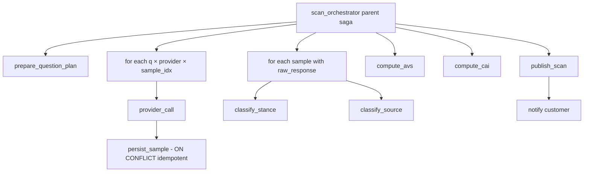

# AISO Background Task and Scan Execution — Specification v1.0.0

**Status:** Active
**Effective from:** 2026-06-01

## Architectural decision

- **v1 queue substrate: Procrastinate (Postgres-as-queue)**
- **Architectural pattern: Hexagonal (ports and adapters)**
- **Delivery semantics: At-least-once + idempotency at every layer**
- **Failure handling: Saga orchestration with partial-completion semantics**

## Hexagonal seam — ports

Define in `api/domain/ports.py`. Zero third-party imports.

```python
from typing import Protocol, Literal, Optional, AsyncIterator
from dataclasses import dataclass
from uuid import UUID
from datetime import datetime

ScanStatus = Literal["queued", "running", "succeeded", "partial", "failed", "cancelled"]

@dataclass(frozen=True)
class ScanHandle:
    scan_run_id: UUID
    idempotency_key: str
    enqueued_at: datetime
    methodology_version: str

@dataclass(frozen=True)
class ProviderProgress:
    provider: str
    completed: int
    failed: int
    rate_limited: int
    last_status: str

@dataclass(frozen=True)
class ScanProgress:
    status: ScanStatus
    total_calls: int
    completed_calls: int
    failed_calls: int
    per_provider: dict[str, ProviderProgress]
    eta_seconds: Optional[int]
    cost_spent_usd: float
    cost_budget_usd: float

class ScanExecutor(Protocol):
    async def enqueue(
        self, *,
        scan_run_id: UUID,
        idempotency_key: str,
        client_id: UUID,
        methodology_version: str,
        cost_budget_usd: float,
        priority: int = 0,
    ) -> ScanHandle: ...
    async def status(self, scan_run_id: UUID) -> ScanProgress: ...
    async def cancel(self, scan_run_id: UUID, reason: str) -> None: ...

class ProgressReporter(Protocol):
    async def report(self, scan_run_id: UUID, progress: ScanProgress) -> None: ...
    async def subscribe(self, scan_run_id: UUID) -> AsyncIterator[ScanProgress]: ...

class LLMProvider(Protocol):
    async def complete(
        self, *,
        prompt: str,
        seed: int,
        temperature: float,
        idempotency_key: str,
    ) -> "ProviderResponse": ...

class CostLedger(Protocol):
    async def record(self, scan_run_id: UUID, provider: str, usd: float) -> float: ...
    async def remaining(self, scan_run_id: UUID) -> float: ...
```

**Rule:** domain code (`api/domain/*`) imports ONLY from `api/domain/ports.py` and stdlib. Procrastinate, OpenAI, Anthropic, FastAPI live in `api/adapters/*`.

## Procrastinate executor adapter

```python
class ProcrastinateScanExecutor(ScanExecutor):
    def __init__(self, app: procrastinate.App):
        self.app = app

    async def enqueue(self, *, scan_run_id, idempotency_key, client_id,
                      methodology_version, cost_budget_usd, priority=0):
        try:
            await scan_orchestrator_task.configure(
                queueing_lock=f"scan:{client_id}",   # per-client idempotency
                lock=f"client:{client_id}",          # per-client serialization
                priority=priority,
                schedule_in={"seconds": 0},
            ).defer_async(
                scan_run_id=str(scan_run_id),
                idempotency_key=idempotency_key,
                methodology_version=methodology_version,
                cost_budget_usd=cost_budget_usd,
            )
        except procrastinate.exceptions.AlreadyEnqueued:
            return await self._lookup_handle(client_id)
        return ScanHandle(scan_run_id, idempotency_key, datetime.utcnow(),
                          methodology_version)
```

## Idempotency at every layer

| Layer | Key | Storage | Window | Prevents |
|---|---|---|---|---|
| HTTP (POST /scans) | Client-generated UUIDv4 in `Idempotency-Key` header | `idempotency_keys` table | 24h | Double-charge on retry click |
| Queue enqueue | `queueing_lock = scan:{client_id}` | `procrastinate_jobs` | Until completion | Two concurrent enqueues |
| Saga step | `(scan_run_id, step_id)` | `scan_steps` table; `ON CONFLICT DO NOTHING` | Lifetime of scan | Worker restart redoing work |
| Provider call | Provider's native idempotency-key header | Provider-side | Provider-defined | Network retry generating 2nd completion |
| DB write of sample | `(scan_run_id, question_id, provider, sample_index)` UNIQUE | `samples` table | Forever | Duplicate sample rows |

## Saga semantics

Scan = orchestrated saga (not choreography). Single `scan_orchestrator_task` reads question plan, fans out provider calls, awaits results, fans out classifier calls, computes AVS, publishes.



## Compensation logic

Most steps have trivial compensations (work is read-mostly). The only "real" side effect is money spent on LLM tokens, which cannot be un-spent.

- **Failed provider call**: write `samples` row with `raw_response = NULL`, `failure_reason = '…'`. AVS filters these out.
- **Failed classifier**: sample recorded with `classified = false`. Reaggregation revisits.
- **Cost budget exhausted**: scan marked `partial`, AVS computed on successful samples, customer notified. No compensation runs.

## Partial-completion semantics

| `completeness` | Criteria | Customer-facing UX |
|---|---|---|
| `complete` | 100% samples | Standard report |
| `partial_acceptable` | ≥95% per provider, ≥3 per cell | "Completed with X% provider errors" |
| `partial_degraded` | <95% in any provider | "Anthropic only — scan incomplete for OpenAI today" |
| `failed` | <3 samples per cell in majority providers | "Scan failed; not charged" |

## Custom retry strategy (jitter + cost-budget)

Procrastinate's `RetryStrategy` lacks jitter. Subclass:

```python
class CostAwareRetry(BaseRetryStrategy):
    def get_retry_decision(self, *, exception, job):
        if isinstance(exception, CostBudgetExhausted):
            return RetryDecision(retry_at=None)  # terminal
        if isinstance(exception, ProviderRateLimit):
            return RetryDecision(retry_at=now() + exception.retry_after + jitter())
        if attempts(job) >= 5:
            return RetryDecision(retry_at=None)
        return RetryDecision(retry_at=now() + 2**attempts(job) + jitter())

def jitter():
    return timedelta(seconds=random.uniform(0, 30))
```

## Stalled-job recovery (mandatory)

```python
@app.periodic(cron="*/2 * * * *")
@app.task(queueing_lock="retry_stalled_jobs", pass_context=True)
async def retry_stalled_jobs(context, timestamp):
    stalled = await context.app.job_manager.get_stalled_jobs(nb_seconds=120)
    for job in stalled:
        await context.app.job_manager.retry_job(job)
```

## Postgres schema additions (beyond versioning-1.0)

```sql
CREATE TABLE clients (
    id            UUID PRIMARY KEY,
    tier          TEXT NOT NULL CHECK (tier IN ('free','pro','growth','scale','enterprise')),
    cost_budget_default_usd NUMERIC(10,2) NOT NULL,
    byok          BOOLEAN NOT NULL DEFAULT false,
    byok_keys     JSONB DEFAULT '{}',
    owned_domains TEXT[] DEFAULT '{}',
    competitor_domains TEXT[] DEFAULT '{}',
    created_at    TIMESTAMPTZ NOT NULL DEFAULT NOW()
);

CREATE TABLE scan_runs (
    id                    UUID PRIMARY KEY,
    client_id             UUID NOT NULL REFERENCES clients(id),
    idempotency_key       TEXT NOT NULL,
    methodology_version   TEXT NOT NULL,
    status                TEXT NOT NULL,
    completeness          TEXT,
    cost_budget_usd       NUMERIC(10,4) NOT NULL,
    cost_spent_usd        NUMERIC(10,4) NOT NULL DEFAULT 0,
    latency_class         TEXT NOT NULL,
    enqueued_at           TIMESTAMPTZ NOT NULL DEFAULT NOW(),
    started_at            TIMESTAMPTZ,
    finished_at           TIMESTAMPTZ,
    error_summary         JSONB,
    UNIQUE (client_id, idempotency_key)
);
CREATE INDEX idx_scan_runs_client_status ON scan_runs (client_id, status);

CREATE TABLE scan_progress (
    scan_run_id      UUID PRIMARY KEY REFERENCES scan_runs(id) ON DELETE CASCADE,
    status           TEXT NOT NULL,
    stage            TEXT NOT NULL DEFAULT 'queued',
    total_calls      INT NOT NULL,
    completed_calls  INT NOT NULL DEFAULT 0,
    failed_calls     INT NOT NULL DEFAULT 0,
    per_provider     JSONB NOT NULL DEFAULT '{}',
    eta_seconds      INT,
    updated_at       TIMESTAMPTZ NOT NULL DEFAULT NOW()
);

CREATE TABLE samples (
    scan_run_id        UUID NOT NULL REFERENCES scan_runs(id) ON DELETE CASCADE,
    question_id        TEXT NOT NULL,
    provider           TEXT NOT NULL,
    sample_index       SMALLINT NOT NULL,
    seed               BIGINT NOT NULL,
    raw_response       JSONB,
    system_fingerprint TEXT,
    cost_usd           NUMERIC(10,6) NOT NULL DEFAULT 0,
    provider_idem_key  TEXT NOT NULL,
    classified_stance  TEXT,
    classified_source  TEXT,
    failure_reason     TEXT,
    created_at         TIMESTAMPTZ NOT NULL DEFAULT NOW(),
    PRIMARY KEY (scan_run_id, question_id, provider, sample_index)
);

CREATE TABLE scan_steps (
    scan_run_id   UUID NOT NULL REFERENCES scan_runs(id) ON DELETE CASCADE,
    step_id       TEXT NOT NULL,
    event         TEXT NOT NULL CHECK (event IN ('started','succeeded','failed','compensated')),
    attempt       SMALLINT NOT NULL DEFAULT 1,
    payload       JSONB,
    occurred_at   TIMESTAMPTZ NOT NULL DEFAULT NOW(),
    PRIMARY KEY (scan_run_id, step_id, event, attempt)
);
CREATE INDEX idx_scan_steps_at ON scan_steps (scan_run_id, occurred_at);

CREATE TABLE idempotency_keys (
    key             TEXT PRIMARY KEY,
    scope           TEXT NOT NULL,
    request_hash    TEXT NOT NULL,
    response_status SMALLINT,
    response_body   JSONB,
    created_at      TIMESTAMPTZ NOT NULL DEFAULT NOW(),
    locked_at       TIMESTAMPTZ,
    completed_at    TIMESTAMPTZ
);
CREATE INDEX idx_idempotency_gc ON idempotency_keys (created_at) WHERE completed_at IS NOT NULL;

CREATE TABLE cost_ledger (
    scan_run_id   UUID NOT NULL REFERENCES scan_runs(id) ON DELETE CASCADE,
    provider      TEXT NOT NULL,
    spent_usd     NUMERIC(10,6) NOT NULL DEFAULT 0,
    updated_at    TIMESTAMPTZ NOT NULL DEFAULT NOW(),
    PRIMARY KEY (scan_run_id, provider)
);
```

## Progress reporting

### v1: polling

```
GET /v1/scans/{scan_run_id}/progress
→ 200 { status, stage, total_calls, completed_calls, failed_calls,
        per_provider, eta_seconds, cost_spent_usd, cost_budget_usd }
```

Frontend: poll every 3s; backoff to 10s after 5 min of no change; stop on terminal status.

### v2: SSE (deferred)

When polling cost > 5 RPS sustained → migrate to `sse-starlette` backed by Postgres `LISTEN scan_progress_{id}`.

## Observability minimum

| Tool | Purpose | Tier |
|---|---|---|
| **Sentry** | Error tracking, 100% trace on error / 1% on success | Free ≤5K errors/mo |
| **structlog** | JSON logs with `scan_run_id`, `step_id`, `provider`, `attempt`, `cost_usd_so_far` | Free |
| **Postgres** | `scan_steps` is event log; `scan_progress` is current-state view | Existing |

**Defer OpenTelemetry to v2** (when one scan in last 24h can't be debugged from Sentry alone in <5 min).

## Cost-aware scheduling

- Free / BYOK Free tier: **always batch API**, 24h completion window.
- Starter+: user-triggered real-time during day; nightly auto-scans batched.
- Growth/Scale: real-time by default; optional batch for cost savings.
- Enterprise: dedicated rate-limit pool.

Per-tier default cost budgets:
- Free: $5
- Starter: $15
- Growth: $30
- Scale: $50
- Enterprise: unbounded

## Migration roadmap

| Stage | Customers | Substrate | Migration trigger |
|---|---|---|---|
| **v1 (now)** | 2–50 | Procrastinate on existing Postgres | None until 100+ |
| **v2** | 50–500 | Procrastinate + separate queue DB; prompt-cache; SSE | Queue DB CPU > 60% sustained |
| **v3** | 500–5,000+ | Temporal Python SDK (Cloud → self-host) | Multi-hour scan can't resume; methodology version mid-flight; MultiXact SLRU contention |

## Version bump rules

| Change | Bump |
|---|---|
| Queue substrate change (Procrastinate → Temporal) | Major (execution-2.0); adapter swap |
| Saga structure change | Minor |
| Retry strategy change | Minor |
| Cost budget defaults | Patch |

## Limitations

1. No empirical benchmark of Procrastinate at AISO's specific shape; instrument `pg_stat_activity` from day one.
2. Procrastinate lock-release-on-crash gap = up to 2-minute delay per stalled-job heartbeat.
3. 95% completeness threshold is chosen heuristic, not proven optimum.
4. Cross-customer prompt caching has a privacy explainability cost AISO has not yet had to defend.
5. Temporal workflow-versioning and AISO methodology-versioning are different axes; needs explicit design at v3.

## References

- Cockburn (2005) — hexagonal architecture
- Percival & Gregory — *Architecture Patterns with Python* (cosmicpython.com)
- Garcia-Molina & Salem (SIGMOD 1987) — Sagas
- McCaffrey (JOTB17) — Distributed Sagas
- Richardson (microservices.io) — Saga + Transactional Outbox patterns
- Stripe — Idempotency keys (Brandur Leach)
- FLP impossibility (Fischer, Lynch, Paterson 1985)
- Two Generals' Problem (Akkoyunlu et al. 1975)
- Procrastinate documentation (readthedocs.io)
- Leach (brandur.org) — Postgres job-queue MVCC pitfalls
- Griggs (PlanetScale, April 2026) — 800 jobs/sec death-spiral threshold
- Temporal — OpenAI Agents SDK integration GA March 2026
